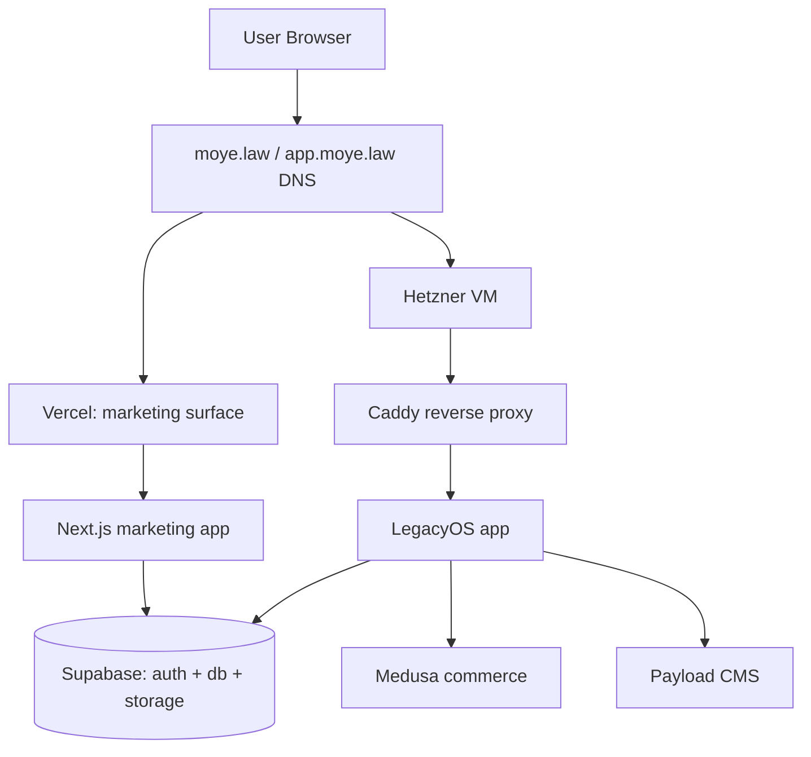
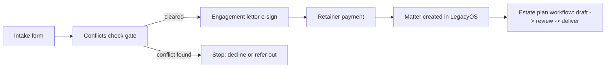

# Moye Law v3 Website Build and LegacyOS Migration Report

## Executive summary
The current v2 deployment is close to a shippable storefront but is blocked by a small set of high-severity issues: (1) NY attorney-advertising compliance problems (fabricated testimonials, unverifiable “fixed price automation” product claims, and an inaccurate firm name/address/footer) that must be corrected before any DNS cutover, (2) operational breakage and security exposure caused by missing production environment variables (notably `/resources` returning a 500 and `/admin` being reachable publicly), and (3) structural app-router tech debt (duplicate layouts, missing layouts, and a nonfunctional mobile nav) that creates inconsistent UX and undermines SEO. Evidence from the live v1 render and the repo’s architecture reference supports retiring v1 as a client-rendered SPA and moving fully to a Next.js App Router v3 scaffold backed by a portable Supabase-first “intake → conflicts → e-sign → payment → matter” pipeline, with a deliberate split deployment target: marketing on Vercel and LegacyOS on Hetzner once the Docker/Caddy stack is production-ready. citeturn4view0turn2view0turn3view2turn3view3turn0search2turn20search0turn19search0turn18search0

## Current-state inventory of visible UX and content
### v1 storefront signals and crawlability
The live v1 homepage renders as essentially a minimal HTML shell (“MOYE LAW”) when fetched without client-side execution, consistent with the repo’s description of v1 as a pure SPA where crawlers/preview bots see little to no per-route content. citeturn2view0turn4view0  
In the v1 `index.html`, there are additional SEO red flags that would be carried into “view source” (e.g., canonical URL left as a placeholder and incomplete structured data). fileciteturn29file0L1-L1

### v2 homepage and key routes
The v2 homepage (“Moye Law Systems | Advanced Legal Architecture”) is visually/structurally coherent and matches the “Hybrid-Mondrian / Kinetic Structuralism” intent, but contains multiple compliance and factual-support liabilities that are currently “above the fold” or in prominent sections:  
- Productized offerings are presented as “FIXED_PRICE” automations (“Will & Trust Generator”, “Auto‑Trademark Filing”, “Dead Man’s Switch”, etc.) with CTA text implying immediate ordering/automation. citeturn2view1  
- Testimonials appear as named client quotes (“Sarah Jenkins / TechFlow Inc.” and “The Harrison Family”), without the required “Prior results do not guarantee a similar outcome” disclaimer and without evidentiary support presented. citeturn2view1turn5view3turn0search0  
- Footer presents a California address and a firm name that conflicts with your stated canonical identity (“Moye Law, PC”), plus an asserted Next.js version string and outdated copyright. citeturn2view1turn5view2  

Route behavior and UX consistency issues visible in production:
- `/practice` shows the nav + footer duplicated twice on the same page (clearly visible as repeated header and footer blocks). citeturn3view0  
- `/services` renders without the global nav and footer style used elsewhere, creating a “different site” feel. citeturn3view1  
- `/resources` returns HTTP 500 (internal server error), blocking the “Resources” surface entirely. citeturn3view2  
- `/admin` is reachable publicly and presents “control plane” content. Even if it is a placeholder, exposing it publicly is a security/UX foot‑gun because it invites probing and creates ambiguity about whether a client/admin portal exists today. citeturn3view3  
- `/contact` publishes a Mountain View address and a placeholder phone number (650‑999‑9999). citeturn3view4  

image_group{"layout":"carousel","aspect_ratio":"16:9","query":["moye-law-version-2.vercel.app homepage screenshot","moye.law homepage screenshot"],"num_per_query":1}

## Repo audit of tech debt, compliance flags, and reusable assets
### What the repo itself says is load-bearing
`ARCHITECTURE.md` positions itself as the authoritative technical reference, including explicit “behind-the-curtain” quarantine constraints (no Sushi metaphors on the public site) and a description of v1 as a SPA with SEO problems, while v2 is the production target in a `moye-law-web/` subdirectory deployed to Vercel. citeturn4view0  

### High-impact implementation details causing production breakage
- **Broken `/resources`: missing Supabase server envs cause runtime crash.** The server Supabase helper uses non-null assertions on `NEXT_PUBLIC_SUPABASE_URL` and `NEXT_PUBLIC_SUPABASE_ANON_KEY`, so a misconfigured deployment will throw/500 rather than degrade gracefully. citeturn5view4turn3view2  
- **Admin exposure due to “env-missing allowlist” middleware behavior.** The middleware explicitly “allows the request” when Supabase keys are missing, which is a reasonable local-build safety but is a dangerous production default because it disables route protection when env vars are absent. fileciteturn18file0L1-L1  
- **Duplicate layout composition on `/practice`.** `app/practice/layout.tsx` already injects `NavBarV2` + `TerminalFooter`, while `app/practice/page.tsx` also injects them, producing the visible duplication. fileciteturn21file0L1-L1 fileciteturn20file0L1-L1 citeturn3view0  
- **Missing layout for `/services`.** `ServiceTemplate.tsx` renders a full page without using `NavBarV2` or `TerminalFooter`, aligning with the observed missing global chrome on `/services`. fileciteturn19file0L1-L1 citeturn3view1  
- **Mobile nav is visually present but functionally unwired.** The hamburger “trigger” is a static button with no state/menu implementation. citeturn5view0  

### Compliance flags embedded in components
- **Testimonials.** `LegalExhibit.tsx` hardcodes the named testimonials shown on the homepage. citeturn5view3  
- **Firm name/address/version string.** `TerminalFooter.tsx` includes “© 2024 MOYE LAW GROUP” and the Mountain View, CA address and a “Next.js v14.0” version string. citeturn5view2  
- **Product automation framing.** The homepage composes “FIXED_PRICE” product cards with copy implying instant/automated outputs. fileciteturn13file0L1-L1 citeturn2view1  

### Security and build reproducibility flags
- **Committed `.env`.** The repo contains a committed `.env` with Firebase configuration values, which violates the default “don’t commit env secrets” posture even if some values are not strictly secret. fileciteturn25file0L1-L1 citeturn20search2  
- **CI/CD mismatch.** GitHub Actions is configured to build and deploy the root `dist/` (v1) to GitHub Pages on push to `main`, which is a potential source of confusion while v2/v3 are intended for Vercel. fileciteturn30file0L1-L1  
- **Payload scaffold compatibility risk.** `payload.config.ts` and `@payloadcms/next` routes exist, but Payload’s current installation requirements include Node.js ≥20.9 and Next.js ≥16.2.0, which does not match v2’s Next.js 16.0.10 dependency pin. fileciteturn24file0L1-L1 citeturn16search2  

## Prioritized findings, remediation tasks, and v3 mapping
### Findings table
| Page / component | Visible issue | Repo file(s) | Severity | Remediation steps (actionable) | Est. dev time (hrs) |
|---|---|---|---|---|---:|
| v2 Home | Hardcoded testimonials with named “clients” and no required disclaimer | `moye-law-web/src/components/content/LegalExhibit.tsx` citeturn5view3 | P0 | Remove the testimonial section entirely or replace with (a) verified testimonials + required disclaimer “Prior results do not guarantee a similar outcome,” or (b) non-testimonial “Client principles” copy. Align with Rule 7.1 factual-support + disclaimer requirements. citeturn0search0 | 1–3 |
| v2 Home + Product cards | Product copy implies instant automation (“FIXED_PRICE” + “INITIALIZE_ORDER()” for generators/filings) | `moye-law-web/src/app/page.tsx`, `SplitServiceCard.tsx` fileciteturn13file0L1-L1 fileciteturn14file0L1-L1 | P0 | Reframe “products” as consultation-only offerings or “in development” with precise scoping; remove ordering language unless the automation actually exists. Ensure claims are factually supportable as of publish date (Rule 7.1). citeturn0search0turn2view1 | 2–6 |
| Global footer | Wrong firm name (“MOYE LAW GROUP”), wrong address (entity["city","Mountain View","California, US"]), outdated copyright, false Next.js version string | `TerminalFooter.tsx` citeturn5view2 | P0 | Replace with “© 2026 Moye Law, PC”; remove version string; update address to 1212 Main Street, entity["city","Harrison","NY, US"]; ensure all footer links are real links (not `<li>` placeholders). Rule 7.5 “PC” naming posture. citeturn14search3turn2view1 | 1–4 |
| `/resources` | HTTP 500 in production | `app/resources/page.tsx`, `lib/supabase/server.ts` citeturn3view2turn5view4 | P0 | Add a true “degraded mode” when Supabase env vars are missing (render a static Resources landing without DB calls); add Vercel env vars for Preview + Production; add runtime assertion that Production builds fail/alert if envs missing. citeturn20search0turn0search8 | 2–5 |
| `/admin` | Publicly reachable “admin console” | `middleware.ts` (env-missing bypass) fileciteturn18file0L1-L1 | P0 | Remove env-missing bypass in any non-local environment; require auth for `/admin*`; consider hard 404 for public builds unless explicitly enabled. Align with least-privilege and Rule 1.6 data-protection posture. citeturn14search0turn3view3 | 1–4 |
| `/practice` | Nav/footer duplicated (layout + page both render) | `app/practice/layout.tsx`, `app/practice/page.tsx` fileciteturn21file0L1-L1 fileciteturn20file0L1-L1 | P1 | Remove duplicated chrome from page; enforce “layout owns shell, page owns content” rule across routes. citeturn3view0 | 0.5–1 |
| `/services` | Missing global nav/footer; inconsistent brand experience | `components/templates/ServiceTemplate.tsx` fileciteturn19file0L1-L1 | P1 | Add `app/services/layout.tsx` with NavBar + Footer; refactor `ServiceTemplate` to be content-only. citeturn3view1 | 1–3 |
| Mobile nav | Hamburger exists but does nothing | `NavBarV2.tsx` citeturn5view0 | P1 | Implement mobile menu sheet/drawer with accessible focus management; ensure all nav items reachable; test with keyboard and small screens. | 2–6 |
| SEO / metadata | Risk of missing per-page metadata; Server/Client component constraints if pages are marked `"use client"` | Many routes; root metadata in `app/layout.tsx` fileciteturn22file0L1-L1 | P1 | Enforce server pages for metadata; move interactive UI to client subcomponents; implement `generateMetadata` per route where needed. citeturn0search2turn0search4 | 4–10 |
| Payload scaffold | Present in code but dep incompatibility likely | `payload.config.ts`, `(payload)/cms/...` fileciteturn26file0L1-L1 fileciteturn27file0L1-L1 | P2 | Either (a) upgrade Next.js to a compatible 16.2+ and Node 20.9+ for Payload, or (b) pin Payload to a compatible version and document it; do not ship partially wired CMS routes publicly. citeturn16search2 | 4–12 |
| Secrets hygiene | Committed `.env` | `.env` fileciteturn25file0L1-L1 | P0 | Remove `.env` from repo; rotate any keys that are secrets; ensure `.env.local` is gitignored; migrate v1 Firebase remnants to documented retirement plan. citeturn20search2 | 1–3 |

### v3 scaffold mapping from v2 assets
The fastest v3 path is to treat the v2 design system and layout primitives as a vendorable UI layer, while fixing the structural composition rules:
- **Reusable “tokens and primitives”**: `globals.css` theme variables and font loading in `app/layout.tsx` translate cleanly into a v3 `design-tokens/` package or a vendored folder shared between marketing (Vercel) and app surfaces. fileciteturn23file0L1-L1 fileciteturn22file0L1-L1  
- **Reusable “chrome + hero + grid components”**: `NavBarV2`, `HeroV2`, and the grid/card primitives are worth cherry-picking, but the v3 rule should be: *layouts own global chrome; pages own content; client components are leaf nodes only* to preserve metadata/SEO and avoid App Router pitfalls. citeturn0search2turn0search4  
- **Naming quarantine**: internal “Sushi*” component names exist in v2 templates; while not automatically visible, they increase the chance of leakage into UI strings/logs and violate your quarantine posture as a “Code-as-policy” discipline. The repo’s own architecture reference explicitly forbids Sushi terminology on the public site. citeturn4view0  

## Migration checklist for the 7‑day sprint
Assumptions: (a) “LegacyOS v1 on Vercel” is acceptable for week one, and (b) the Hetzner Docker/Caddy stack becomes the post-sprint migration target, not a sprint dependency. (If either assumption is wrong, the critical path changes immediately.)

### Day-by-day tasks
**Day 1 (non‑negotiable, launch blockers)**  
Implement the four authorized compliance fixes end-to-end in v3: remove fake testimonials, correct footer address/name, reframe non-existent automation as consultation-only/in-development, and update copyright/remove false version string. Map each fix to a dedicated PR with screenshot evidence from Preview deployments. citeturn2view1turn5view2turn5view3turn0search0turn14search3  
Stand up a working Supabase project + env propagation for Preview and Production on Vercel; add a “fail closed” behavior for admin routes and “fail soft” behavior for resources pages. citeturn20search0turn0search8  

**Day 2 (v3 scaffold and UX integrity)**  
Create v3 app-router structure with strict layout/page composition conventions; fix `/practice` duplication and add `/services` layout; implement working mobile nav including keyboard accessibility. citeturn3view0turn3view1turn5view0  

**Day 3 (intake surface + conflicts check foundations)**  
Implement intake capture tables in Supabase with Row Level Security enabled by default; build minimal “intake → conflicts check gate” flow that prevents engagement progression until conflicts check status is resolved. citeturn16search0turn14search1turn14search2  

**Day 4 (e‑signature + engagement letter)**  
Wire an e-signature step (provider TBD) with auditable envelopes and immutable storage. Ensure privileged/confidential documents do not route through third-party LLM services without explicit safeguards to satisfy Rule 1.6 posture. citeturn14search0  

**Day 5 (retainer payment + matter creation)**  
Implement payment intake (provider TBD) and creation of a “matter” record after successful payment + executed engagement letter; enforce least-privilege access and RLS policies for client data. citeturn16search0  

**Day 6 (LegacyOS v1 operational path)**  
Ship a working “matter dashboard” that reflects phenomenological grounding (matter as a synthesis of artifacts: intake, conflicts, signed engagement, payment record, plan drafting state). Keep the data model portable (no Vercel-only primitives), anticipating later Hetzner deployment.

**Day 7 (Option C or Option B acceptance test)**  
Run a scripted end-to-end test against the “family-of-four estate plan happy path.” If Option C (public) fails, hard-switch to Option B (private beta) with Penny and Chris Jr. as secondary users and write the postmortem if neither is true.

## Agent playbook and risk register
### Cursor / LLM agent playbook (prompts → expected outputs)
Use these as “atomic PR” prompts; each should produce a single reviewable change-set, tests (where applicable), and a deployment note.

**Compliance PR: testimonials + footer fixes**  
Prompt: “Remove `LegalExhibit` from the homepage, delete or replace it with compliant non-testimonial content; update footer firm name to ‘Moye Law, PC,’ address to Harrison, NY, remove any Next.js version string, update copyright to 2026. Provide screenshots for home, practice, contact.”  
Expected output: 1 PR, code diff, before/after screenshots, and a compliance note referencing Rule 7.1/7.5. citeturn0search0turn14search3turn5view2turn5view3  

**Security PR: admin lockdown + env handling**  
Prompt: “Make `/admin*` inaccessible unless authenticated; remove ‘env missing allow’ bypass for non-local; add runtime assertions for required env in Production; ensure `/resources` never 500s when env missing—render static fallback.”  
Expected output: 1 PR, clear local/dev instructions, and a vercel env checklist. citeturn20search0turn5view4turn3view2turn3view3  

**UX PR: layout normalization**  
Prompt: “Fix `/practice` double header/footer by removing chrome from the page; create `/services/layout.tsx` and refactor `ServiceTemplate` to content-only; ensure consistent nav/footer across routes.”  
Expected output: 1 PR, route-by-route verification notes. citeturn3view0turn3view1  

**SEO PR: metadata enforcement**  
Prompt: “Audit all App Router pages: ensure pages remain Server Components; move interactive UI into client leaf components; add `generateMetadata` where missing; validate OpenGraph/Twitter tags.”  
Expected output: 1 PR, manifest of routes touched, and a metadata coverage report aligned with Next.js server-only metadata constraints. citeturn0search2turn0search4  

**LegacyOS PR: Supabase schema + RLS policies**  
Prompt: “Define Supabase schema for intake, conflicts checks, matters, documents, payments; enable RLS; write baseline policies for client isolation; produce SQL migrations + a README describing how to apply them.”  
Expected output: SQL migrations + docs; no secrets committed. citeturn16search0turn20search2  

### Risk register
**Compliance risks (highest probability + impact)**
- Testimonials and “expected results” statements without factual support and required disclaimer violate Rule 7.1 and must be removed or substantiated before cutover. citeturn0search0turn2view1turn5view3  
- Incorrect firm naming (“GROUP” vs “PC”) and inaccurate address in website footer risks Rule 7.5 posture and user deception. citeturn14search3turn5view2turn2view1  
- Product claims implying automated legal outputs that do not exist yet create “false/misleading” advertising risk under Rule 7.1. citeturn0search0turn2view1  

**Security and confidentiality risks**
- Admin surface publicly reachable + env-gated auth bypass increases attack surface and undermines client trust; if later connected to real data it becomes a Rule 1.6 problem. citeturn14search0turn3view3  
- Committed env/config patterns normalize poor secret hygiene; Next.js explicitly warns you “almost never want to commit” env files. citeturn20search2  

**Operational and delivery risks**
- Payload + Medusa both require Node 20+ in common deployment patterns (Medusa explicitly uses node:20-alpine in its Docker guide; Payload requires Node 20.9+ and a compatible Next.js range). This can conflict with existing pins and must be planned rather than discovered mid-sprint. citeturn19search0turn16search2  
- Split deployment (Vercel vs Hetzner) introduces integration drift; mitigate by avoiding Vercel-specific primitives and using portable env-based configuration (consistent with Vercel environment variable scoping). citeturn20search0turn0search5  

## Short prioritized backlog and recommended immediate commits for v3
**P0 (ship/no-ship)**
- Remove fake testimonials; add Rule 7.1 disclaimer if any testimonial remains. citeturn0search0turn5view3  
- Replace footer firm name/address/copyright; remove false framework version string. citeturn14search3turn5view2  
- Reframe “automation products” as consultation-only/in-development unless actually operational. citeturn0search0turn2view1  
- Fix `/resources` 500 and lock down `/admin` regardless of env presence. citeturn3view2turn3view3  
- Remove committed `.env`; document env setup; ensure Vercel Preview + Production env parity. citeturn20search0turn20search2  

**P1 (quality and conversion)**
- Fix duplicated `/practice` shell; normalize `/services` layout; implement real mobile nav. citeturn3view0turn3view1turn5view0  
- Metadata coverage audit and enforcement using server-only patterns for `generateMetadata`. citeturn0search2turn0search4  

**P2 (post-sprint architectural runway)**
- Decide Payload strategy: upgrade Next.js pin to meet current Payload requirements or deliberately pin Payload version; do not ship partially wired CMS routes. citeturn16search2  
- Prepare Hetzner Docker/Caddy + Medusa stack using official guidance; keep it portable and reversible. citeturn19search0turn18search0turn15search0